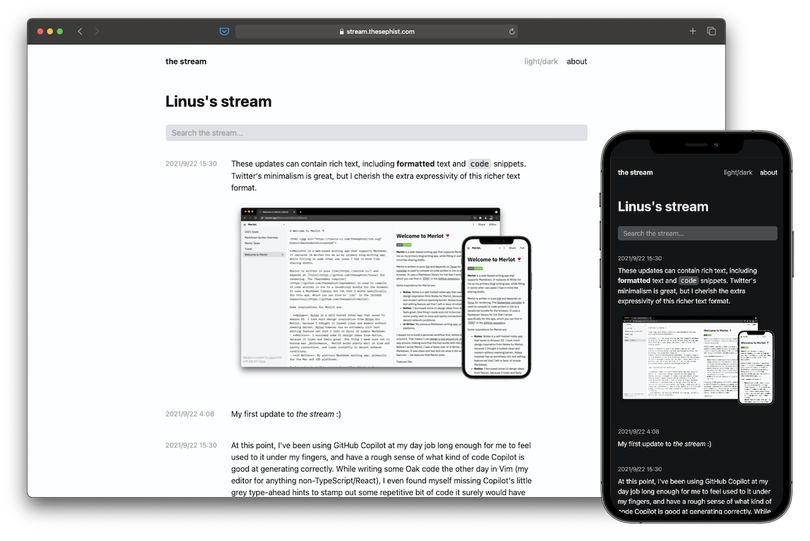

# The stream 🌊

[**The stream**](https://stream.thesephist.com) is like a less noisy, mini Twitter feed I've created just for myself and my updates on my work and thinking. It's a micro-blog in the truest sense of the word -- a timeilne of small casual updates that I can send out quickly on the go. The stream has a public front-end that shows a timeline of updates, and a private interface I use to send new updates and manage old ones.

I've used my [Twitter](https://twitter.com/thesephist) as the main place people can get updates on what I'm working on or thinking about. Twitter is great, but the stream was born out of my desire for a micro-blog that was a little more homebrew, a little more focused, and a little more expressive.

The stream is also the first real application I built with my [Oak programming language](https://oaklang.org/), so building it served as a good testbed and excuse for exercising the language in a real use case and patching in some of the initial bugs and rough edges. At launch, The stream is quite small — only about 500 well-commented lines of Oak code. That seems about right: It's complex enough to be a good test for a fledgling language, but simple enough not to overwhelm it.

## Why not Twitter?

1. Twitter is extremely noisy. There's a million other people vying for your attention next to what I have to say.
2. Twitter is also quite limiting, not just in the character count, but also in that they only let you write in plain text, without any formatting unless you resort to ugly Unicode hacks.
3. Lastly, Twitter is great for "in the moment" discussion in public, but it's not so great as a reference you can link to from the future, and as a historical record of my thinking and work. I wanted a place more purpose-built, more focused, and more permanent for my less permanent thoughts and updates.

## Architecture

The stream is a server-rendered web application written in pure [Oak](https://oaklang.org/), a dynamic programming language I created. It's the first real project using Oak (outside of things like the standard library) for something practical, so I ended up building and revising much of the standard library in the process of building the stream. The stream is server-rendered for the primary reason that Oak doesn't compile to JavaScript yet — there's a little bit of JavaScript to enable some light interactivity like light/dark mode.

The stream keeps all update data in a [JSONL](https://jsonlines.org/) file on the backend, each entry containing a timestamp and the raw Markdown for each update. New updates are efficiently appended to the end of the file, and reading latest updates is as simple as reading the last N entries from the file. Though I give up some performance by going with this format rather than, say, a SQLite database, the ability to edit the data manually or easily inspect and back it up is worth the trouble. (And if performance becomes a problem, I can always easily migrate away later.)

Because the app is so simple (and I'm still trying to figure out what an "idiomatic" Oak web app should look like), there's nothing in the code that resembles a "framework". APIs hit well-defined HTTP routes, which directly call data querying and page rendering functions. Perhaps a better design pattern will appear as I build more sophisticated apps with Oak, but for the stream, this seems simple enough.

## Build and deploy

Oak comes packaged as a single statically-linked executable, avaialble from [the website](https://oaklang.org). I deploy the stream as a systemd process that runs `./src/main.oak`. The server will automatically create a `./db/stream.jsonl` data file if it's not already there when it starts.

I use GNU Make to manage some common development tasks.

- Just `make` to run the server
- `make watch` or `make w` to run the server and re-start anytime the backend code changes
- `make fmt` or `make f` to re-format any files containing unstaged changes using `oak fmt`. This is equivalent to `oak fmt --changes --fix`.
